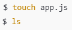

descripción clara y ordenada de los conceptos aprendidos sobre el uso de la consola (terminal) para navegar y crear directorios y archivos, con un listado de comandos principales y pantallazos simulados para complementar.

🖥️ Uso de la consola (terminal)

La consola es una herramienta que permite interactuar con el sistema operativo mediante comandos de texto. En programación se usa para:

Navegar entre carpetas

Crear, mover y eliminar archivos y directorios

Ejecutar programas y herramientas (Git, Node, Python, etc.)

Trabajar desde la consola da más control, velocidad y precisión que hacerlo solo con el explorador gráfico.

📂 Navegación por directorios

Aprendimos a movernos por el sistema de archivos usando rutas:

Ruta absoluta: empieza desde la raíz (/ o C:\)

Ruta relativa: parte desde el directorio actual

Comandos clave:

Ver dónde estamos

Listar archivos

Entrar y salir de carpetas

📄 Creación de directorios y archivos

Desde la consola se pueden crear:

Carpetas para organizar el proyecto

Archivos vacíos o con contenido inicial

Esto es muy común al iniciar proyectos de programación.

📌 Principales comandos utilizados
🔍 Navegación

pwd → muestra la ruta actual

ls → lista archivos y carpetas

cd nombre_carpeta → entra a una carpeta

cd .. → vuelve a la carpeta anterior

cd / → va a la raíz

📁 Directorios

mkdir nombre → crea una carpeta

rmdir nombre → elimina carpeta vacía

rm -r nombre → elimina carpeta con contenido

📄 Archivos

touch archivo.txt → crea un archivo vacío

rm archivo.txt → elimina un archivo

cp origen destino → copia archivos

mv origen destino → mueve o renombra archivos

🧹 Utilidad

clear → limpia la consola

history → muestra comandos usados

exit → cierra la terminal

